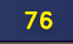
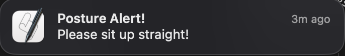

# Posture Tracker

A real-time posture monitoring application that helps prevent poor posture while working at your computer. The application runs in your system tray and uses computer vision to analyze your posture through your webcam.

## Features

- System tray integration for unobtrusive monitoring
- Real-time posture scoring from 0-100
- Visual feedback through color-coded score display
- Configurable tracking intervals (continuous to 4-hour intervals)
- Optional video window showing posture analysis
- Automatic notifications when poor posture is detected
- Cross-platform support (Windows, macOS, Linux)
- Privacy-focused: All processing happens locally on your machine

## Technical Details

The application uses:
- MediaPipe for pose detection and landmark tracking
- OpenCV for video processing and visualization
- PyQt6 for the system tray interface
- Platform-specific notification systems

## Usage

1. Install dependencies: `pip install -r requirements.txt`
2. Run the application: `python src/main.py`
3. Click the tray icon to access the menu
4. Click "Start Tracking" to begin posture monitoring
5. Optionally enable the video window to see the pose detection
6. Choose your preferred tracking interval from the menu
7. The tray icon shows your current posture score (0-100)

The application will notify you when your posture needs correction, helping you maintain a healthier sitting position throughout your workday.

Important: there is an option to enable database logging of posture data (optional in the toolbar, and will be used in the future to build a posture history and model)

## Privacy Note

All video processing is done locally on your computer. No video data is ever stored or transmitted over the internet.

# Images
Here is the toolbar icon that you will see in your system tray:

Here is the toolbar menu that you will see when you click the toolbar icon:

Here is the notification that you will see when your posture is poor:

