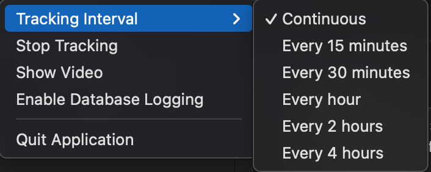

# Posture Tracker

A real-time posture monitoring application that helps prevent poor posture while working at your computer. The application runs in your system tray and uses computer vision to analyze your posture through your webcam.

## Interface Preview

### System Tray Icon

*System tray icon indicating posture status*

### Menu Options

*Available options in the toolbar menu*

### Notifications

*Poor posture alert notification*

## Features

- System tray integration for unobtrusive monitoring
- Real-time posture scoring from 0-100
- Visual feedback through color-coded score display
- Configurable tracking intervals (continuous to 4-hour intervals)
- Optional video window showing posture analysis
- Automatic notifications when poor posture is detected
- Cross-platform support (Windows, macOS, Linux)
- Privacy-focused: All processing happens locally on your machine

## Technical Stack

The application leverages:
- **MediaPipe** - Pose detection and landmark tracking
- **OpenCV** - Video processing and visualization
- **PyQt6** - System tray interface
- **Platform-specific** notification systems

## Getting Started

1. Install dependencies:
   ```bash
   pip install -r requirements.txt
   ```

2. Launch the application:
   ```bash
   python src/main.py
   ```

3. Basic Usage:
   - Click the tray icon to access the menu
   - Select "Start Tracking" to begin monitoring
   - Enable video window (optional) to view pose detection
   - Select your preferred tracking interval
   - Monitor your posture score (0-100) via the tray icon

The application will provide notifications when posture correction is needed, helping maintain proper ergonomics throughout your workday.

> **Note:** Optional database logging is available for posture data tracking, which will support future features including posture history and modeling.

## Privacy Statement

Your privacy is our priority. All video processing occurs locally on your machine, and no video data is ever stored or transmitted over the internet.
